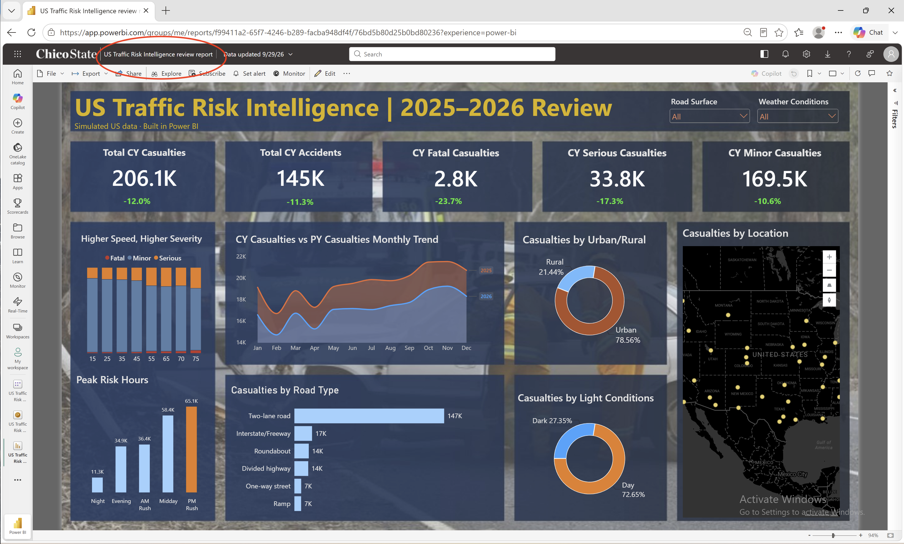
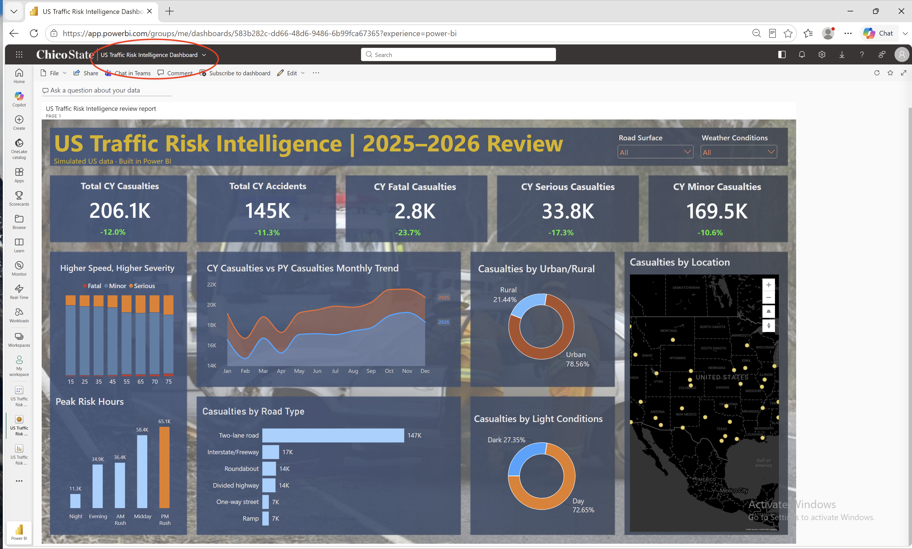
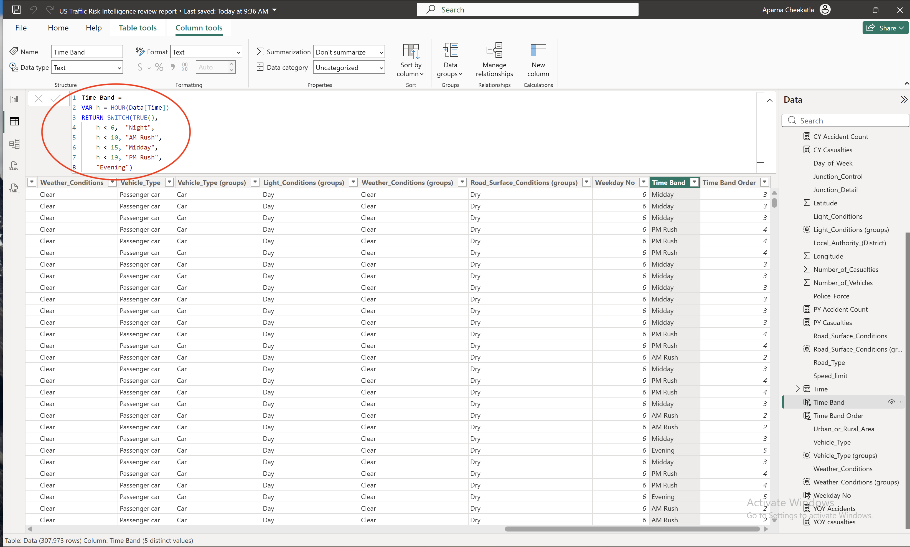
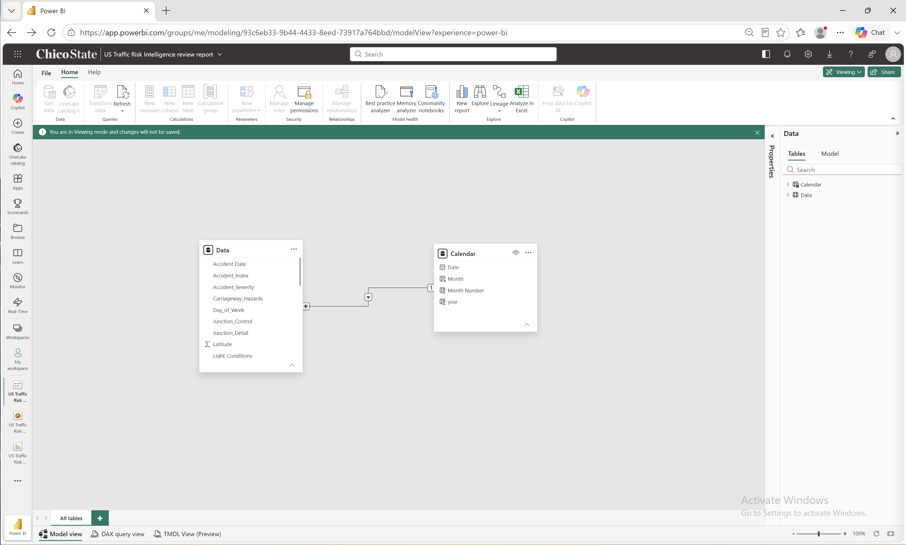

# 🚦 US Traffic Risk Intelligence | Power BI Dashboard (2025 vs 2026)

An end-to-end Power BI project that analyzes **307,973 road accidents** across **58 US counties in 31 states**, comparing 2026 (current year) with 2025 (previous year) to show where, when and under what conditions casualties happen.

> **Note:** The dataset is **simulated**. It follows the structure of the public UK road accident dataset but uses US locations, police agencies, mph speed limits and US road terms, so I could practice a full business-intelligence workflow. The tools, methods and skills are real.



---

## 📌 Business Problem

Road-safety stakeholders (US DOT, state DOTs, highway patrols, EMS, traffic agencies) need one view of:

- Total casualties and accidents this year, and how they changed from last year
- Casualties by severity (Fatal, Serious, Minor)
- The speeds, road types, times of day and conditions linked to the most, and the most severe, casualties
- Where accidents happen on a map

📄 Full requirements: [Business Requirements Document](docs/BRD.pdf)

---

## 🔍 Key Insights (2026)

| Insight | Finding |
|---|---|
| Overall trend | Casualties fell **12.0%** (234.2K → 206.1K) and accidents fell **11.3%** (163.2K → 144.7K) |
| Severity | Fatal casualties fell fastest: **−23.7%**, vs −17.3% serious and −10.6% minor |
| Speed | At **55 mph and above**, the fatal share of casualties doubles (**2.1% vs 1.0%**) and the serious share rises from 14.3% to 21.7% |
| Rural roads | **21.4%** of casualties but **38.9%** of fatal casualties |
| Time of day | The **PM Rush (3–7 PM)** has the most casualties (**65.1K**), 5.8× the overnight total |
| Road type | **Two-lane roads** account for **71.5%** of casualties (147K) |
| Light | **27.35%** of casualties happen in the dark |

---

## 📊 Dashboard

| Visual | What it shows |
|---|---|
| 5 KPI cards | Total casualties, total accidents, and Fatal / Serious / Minor casualties, each with YoY % (green = decrease) |
| Higher Speed, Higher Severity | 100% stacked column: severity mix at each speed limit (15–75 mph) |
| CY vs PY Monthly Trend | Area chart comparing 2026 and 2025 month by month |
| Peak Risk Hours | Casualties by time band: Night, AM Rush, Midday, PM Rush, Evening |
| Casualties by Road Type | Bar chart of 2026 casualties by road type |
| Urban/Rural and Light Conditions | Donut charts (Light grouped into Day / Dark) |
| Casualties by Location | Azure map by county |
| Slicers | Road Surface (Dry / Wet / Ice-Snow) and Weather Conditions (grouped) |

**Power BI Service:** the report is published and a dashboard (**US Traffic Risk Intelligence Dashboard**) was built from a pinned live page.



---

## 🛠️ Skills Demonstrated

| Area | What I did |
|---|---|
| Requirements | Wrote a BRD with 10 business requirements for 9 stakeholder groups |
| Power Query | Set data types, fixed 156 misspelled severity values ("Fetal" → "Fatal"), handled 20 blank cells |
| Data modeling | Fact table + **Calendar** date table, one-to-many relationship, marked as date table |
| DAX | Time intelligence (`TOTALYTD`, `SAMEPERIODLASTYEAR`), `CALCULATE`, `DIVIDE`, `SWITCH(TRUE())`, calculated columns |
| Modeling features | Groups (road surface, weather, light, vehicle), sort-by-column, visual-level filters |
| Visualization | KPI cards, area, 100% stacked column, bar, donut, map, slicers, custom background and theme |
| Power BI Service | Published the report, built a dashboard, pinned a live page |

---

## 🧮 Key DAX

```DAX
CY Casualties = TOTALYTD(SUM(Data[Number_of_Casualties]), 'Calendar'[Date])

PY Casualties = CALCULATE(SUM(Data[Number_of_Casualties]), SAMEPERIODLASTYEAR('Calendar'[Date]))

YOY casualties = DIVIDE([CY Casualties] - [PY Casualties], [PY Casualties])

CY Accident Count = TOTALYTD(COUNT(Data[Accident_Index]), 'Calendar'[Date])
```

**Calendar table**
```DAX
Calendar = CALENDAR(MIN(Data[Accident Date]), MAX(Data[Accident Date]))
```



**Time band** (sorted by a numeric Time Band Order column)
```DAX
Time Band =
VAR h = HOUR(Data[Time])
RETURN SWITCH(TRUE(),
    h < 6,  "Night",
    h < 10, "AM Rush",
    h < 15, "Midday",
    h < 19, "PM Rush",
    "Evening")
```

---

## 🗂️ Data Model



- **Data**: fact table, one row per accident (21 columns + calculated columns)
- **Calendar**: Date, Month, Month Number, Year
- **Relationship**: Calendar[Date] 1 → * Data[Accident Date]

---

## ✅ Validation

| Measure | 2025 | 2026 | YoY |
|---|---|---|---|
| Accidents | 163,249 | 144,724 | −11.3% |
| Casualties | 234,170 | 206,101 | −12.0% |
| Fatal | 3,621 | 2,763 | −23.7% |
| Serious | 40,869 | 33,818 | −17.3% |
| Minor | 189,680 | 169,520 | −10.6% |

Every KPI on the dashboard was checked against these totals from the source file.

---

## 📁 Repository Structure

```
├── data/        US_Road_Accident_Data_2025_2026.zip  (CSV, 307,973 rows)
├── report/      US Traffic Risk Intelligence review report.pbix
├── docs/        BRD.pdf
├── images/      Dashboard.png, DAX.png, model.png, service_dashboard.png
└── README.md
```

## ▶️ How to Use

1. Download `report/US Traffic Risk Intelligence review report.pbix`.
2. Open it in **Power BI Desktop** (free, Windows).
3. The data is already inside the .pbix. To reload it, unzip `data/US_Road_Accident_Data_2025_2026.zip` and point the source to the CSV (**Transform data → Data source settings**).

---

## 👤 Author

**Aparna Cheekatla** · Open to Data Analyst / BI Analyst roles
[LinkedIn](https://www.linkedin.com/in/aparnacheekatla/)
